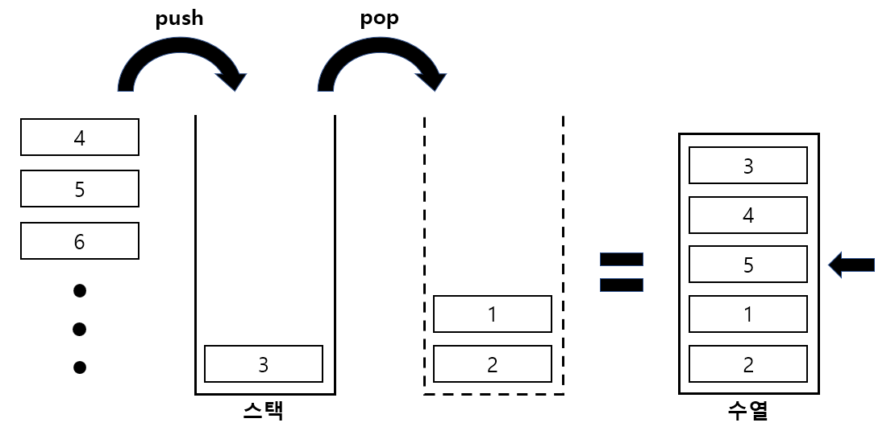

# 1874 스택 수열

## 문제

스택 (stack)은 기본적인 자료구조 중 하나로, 컴퓨터 프로그램을 작성할 때 자주 이용되는 개념이다. 스택은 자료를 넣는 (push) 입구와 자료를 뽑는 (pop) 입구가 같아 제일 나중에 들어간 자료가 제일 먼저 나오는 (LIFO, Last in First out) 특성을 가지고 있다.

1부터 n까지의 수를 스택에 넣었다가 뽑아 늘어놓음으로써, 하나의 수열을 만들 수 있다. 이때, 스택에 push하는 순서는 반드시 오름차순을 지키도록 한다고 하자. 임의의 수열이 주어졌을 때 스택을 이용해 그 수열을 만들 수 있는지 없는지, 있다면 어떤 순서로 push와 pop 연산을 수행해야 하는지를 알아낼 수 있다. 이를 계산하는 프로그램을 작성하라.

## 입력

첫 줄에 n (1 ≤ n ≤ 100,000)이 주어진다. 둘째 줄부터 n개의 줄에는 수열을 이루는 1이상 n이하의 정수가 하나씩 순서대로 주어진다. 물론 같은 정수가 두 번 나오는 일은 없다.

## 출력

입력된 수열을 만들기 위해 필요한 연산을 한 줄에 한 개씩 출력한다. push연산은 +로, pop 연산은 -로 표현하도록 한다. 불가능한 경우 NO를 출력한다.

---

## 풀이



- 리스트로 스택을 구현해 문제풀이, push은 `.append()`, pop은 `.pop()` 메서드 사용
- 1부터 n까지의 수를 차례로 스택에 넣었다 뽑아 넣음으로 수열을 만든다
  - push 연산은 push 1, push 2, push 3 ... 의 형태로 이루어진다
- 스택에 수를 넣었다 뽑아야 하므로 스택이 비어 있다면 push 연산을 해야 한다
- 스택에 수가 있다면 스택 최상단의 수가 현재 입력해야 하는 수라면 pop, 아니면 push
- pop 연산을 n번 하거나 push를 n + 1번 하면 연산 종료
- 연산 종료 후 스택이 비어있으면 연산 과정 출력, 비어있지 않다면 'NO' 출력

---

## 소스코드

```python
# 1874 스택 수열

n = int(input())

stack = [] # 리스트로 스택 구현

# 연산 과정을 기록
commands = [] 
push_count = 0 
pop_count = 0

nums = [int(input()) for i in range(n)] # 입력해야 하는 수열

while pop_count < n and push_count < n + 1: # pop 연산을 n번 하거나, push 연산을 n + 1번 하게 되면 연산 종료

    if stack: # 스택에 수가 존재한다면

        if stack[-1] == nums[pop_count]: # 스택 최상단의 수가 현재 입력해야 하는 수라면
            stack.pop()                  # pop 연산을 실행하고 기록
            pop_count = pop_count + 1
            commands.append('-')

        else:                            # 스택 최상단의 수가 현재 입력해야 하는 수가 아니라면
            stack.append(push_count + 1) # push 연산을 실행하고 기록
            push_count = push_count + 1
            commands.append('+')

    else:     # 스택에 수가 존재하지 않는다면
        stack.append(push_count + 1)     # push 연산을 실행하고 기록
        push_count = push_count + 1
        commands.append('+')

# 연산 종료 후 결과 출력

if stack: 
    print('NO')        # 스택이 비어있지 않다면 불가능한 수열

else:
    for command in commands:
        print(command) # 비어있다면 가능한 수열, 연산 과정 출력

### 맞았습니다!! 36280KB  4148ms
```