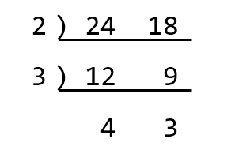

# 2609 최대공약수와 최소공배수

## 문제

두 개의 자연수를 입력받아 최대 공약수와 최소 공배수를 출력하는 프로그램을 작성하시오.

## 입력

첫째 줄에는 두 개의 자연수가 주어진다. 이 둘은 10,000이하의 자연수이며 사이에 한 칸의 공백이 주어진다.

## 출력

첫째 줄에는 입력으로 주어진 두 수의 최대공약수를, 둘째 줄에는 입력으로 주어진 두 수의 최소 공배수를 출력한다.

---

## 핵심개념

### 유클리드 호제법


큰 수 A를 작은 수 B로 나누었을 때 나머지가 0이면 B는 A와 B의 최대공약수  
나머지가 0이 아니라면 A와 B의 최대공약수는 나머지와 b의 최대 공약수와 같다

### 최소공배수



두 수가 서로소가 될때까지 동일한 수로 나누어 줌  
나눈 수와 두 서로소의 곱이 최소공배수  
나눈 수의 곱은 최대공약수, 두 수를 곱한 뒤 최대공약수로 나누어 주면 최소공배수가 된다

## 풀이

---

## 소스 코드

```python
# 2609 최대공약수와 최소공배수

# 유클리드 호제법
# 재귀를 이용해 구현
n, m = map(int, input().split())  # n, m 입력받음
'''
if n >= m:
    a = n
    b = m

else:
    a = m
    b = n
'''
# 큰 수 a를 작은 수 b로 나누어 떨어지면 b는 a와 b의 최대공약수
# 나누어 떨어지지 않는다면 a와 b의 최대 공약수는 a / b 나머지와 b의 최대공약수와 같다
def gcd(a, b):
    
    if a % b == 0:
        return b
    
    else:
        return gcd(b, a % b)
    
print(gcd(n, m))
print(int(n * m / gcd(n, m)))  # 최소공배수는 두 수를 서로소가 될 때까지 나눈 수들과 그 서로소의 곱
```

```python
# math 모듈 사용
import math

n, m = map(int, input().split())

print(math.gcd(n, m))
print(math.lcm(n, m))
```