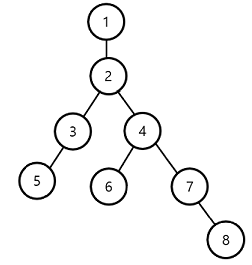
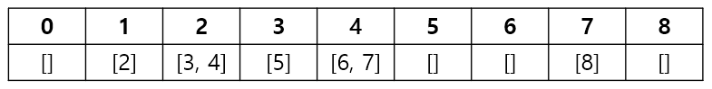

# 14267 회사 문화 1

## 문제

영선회사에는 매우 좋은 문화가 있는데, 바로 상사가 직속 부하를 칭찬하면 그 부하가 부하의 직속 부하를 연쇄적으로 칭찬하는 내리 칭찬이 있다. 즉, 상사가 한 직속 부하를 칭찬하면 그 부하의 모든 부하들이 칭찬을 받는다.  

모든 칭찬에는 칭찬의 정도를 의미하는 수치가 있는데, 이 수치 또한 부하들에게 똑같이 칭찬 받는다.  

직속 상사와 직속 부하관계에 대해 주어지고, 칭찬에 대한 정보가 주어질 때, 각자 얼마의 칭찬을 받았는지 출력하시오.  


---

## 입력

첫째 줄에는 회사의 직원 수 n명, 최초의 칭찬의 횟수 m이 주어진다. 직원은 1번부터 n번까지 번호가 매겨져 있다. (2 ≤ n, m ≤ 100,000)  

둘째 줄에는 직원 n명의 직속 상사의 번호가 주어진다. 직속 상사의 번호는 자신의 번호보다 작으며, 최종적으로 1번이 사장이다. 1번의 경우, 상사가 없으므로 -1이 입력된다.  

다음 m줄에는 직속 상사로부터 칭찬을 받은 직원 번호 i, 칭찬의 수치 w가 주어진다. (2 ≤ i ≤ n, 1 ≤ w ≤ 1,000)  

사장은 상사가 없으므로 칭찬을 받지 않는다.  

## 출력

1번부터 n번의 직원까지 칭찬을 받은 정도를 출력하시오.

---

## 풇이
  

- 직속 상사, 직속 부하의 관계를 트리로 표현
    - 직속 상사를 부모노드, 직속 부하를 자식노드
    - 리스트를 원소로 갖는 리스트를 만들어 인덱스를 부모 노드로, 해당 부모 노드의 자식 노드는 리스트로 표현
- 트리 최상위 노드(사장)부터 시작해 DFS
    - 내리 칭찬은 부모의 노드의 해당 자식 노드의 값을 더하는 것으로 표현 가능
    - DFS를 하며 방문 노드와 방문한 노드의 직전 노드의 값을 더하며 리프노드까지 탐색

---

## 코드

```python
# 14267 회사 문화 1
n, m = map(int, input().split())  # 직원 n명, 칭찬 m회
member = list(map(int, input().split()))  # 각 직원의 직속 상사 번호
graph = [[] for _ in range(n + 1)]  # 직속상사와 부하관계를 나타낼 그래프

for j in range(1, n):  # 2번 사원부터 직속 상사, 부하 관계 작성
    graph[member[j]].append(j + 1)  # 직속상사(부모노드)를 인덱스로 갖고, 직속부하(자식노드)를 해당 인덱스의 리스트로 작성해 트리를 표현
    
compliment = [0] * (n + 1)  # 각 사원별로 받은 칭찬의 정도를 기록할 리스트

for _ in range(m):  # 칭찬 횟수 m번 만큼 반복
    i, w = map(int, input().split())  # 칭찬을 받은 직원번호 i, 칭찬정도 w
    compliment[i] += w  # 각 사원이 받은 칭찬의 정도를 기록

stack = [1]  # 스택을 이용해 DFS

while stack:  # 스택이 빌 때까지 DFS
    v = stack.pop()  # 스택의 원소를 pop(현재 방문할 노드)

    for g in graph[v]:  # 해당 노드의 자식노드들을 순회하며
        stack.append(g)  # 스택에 추가
        compliment[g] += compliment[v]  # 내리칭찬(자신이 받은 칭찬을 자식노드에 더해줌)

print(*compliment[1:], sep=' ')  # 결과값을 양식에 맞게 출력
```
