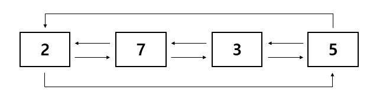
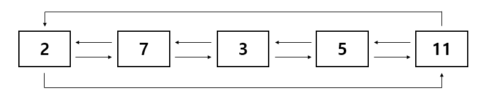
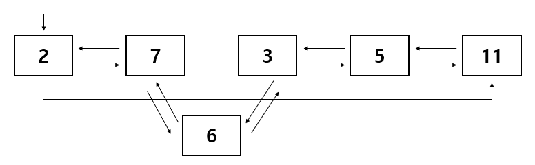
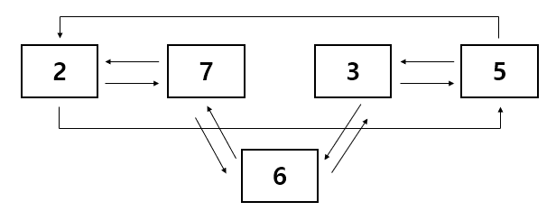

# 23309 철도 공사

## 문제

연세대학교가 위치한 신촌역이 속한 2호선은 그림과 같이 $N$개의 역이 원형으로 연결되어 있다. 각 역은 고유 번호가 할당돼 있으며 역들의 고유 번호는 서로 다르다.   그리고 특정 역의 다음 역은 시계 방향으로 인접한 역을 의미하고, 이전 역은 반시계 방향으로 인접한 역을 의미한다.  

2호선은 지하철 노선들 중 유일한 흑자 노선이다. 때문에 2호선 공사 자금이 넉넉하기에 $M$번의 공사를 거치려고 한다. 각 공사는 다음 4가지 중 하나를 시행한다.  

- 고유 번호 $i$를 가진 역의 다음 역의 고유 번호를 출력하고, 그 사이에 고유 번호 $j$인 역을 설립한다.
- 고유 번호 $i$를 가진 역의 이전 역의 고유 번호를 출력하고, 그 사이에 고유 번호 $j$인 역을 설립한다.
- 고유 번호 $i$를 가진 역의 다음 역을 폐쇄하고 그 역의 고유 번호를 출력한다.
- 고유 번호 $i$를 가진 역의 이전 역을 폐쇄하고 그 역의 고유 번호를 출력한다.

이 때, 이미 설립한 역은 다시 설립하지 않으며 폐쇄한 역은 다시 설립될 수 있다. 그리고 폐쇄 작업은 현재 설립된 역이 $2$개 이상일 때만 들어온다.

2호선을 공사하는 프로그램을 만들어보자.  

---

## 입력

첫 번째 줄에 공사를 시작하기 이전에 있는 역의 개수를 나타내는 양의 정수 $N$과 공사 횟수를 나타내는 양의 정수 $M$이 주어진다. ($1 \le N \le 500\,000$, $1 \le M \le 1\,500\,000$)
 
두 번째 줄에는 공사를 시작하기 이전에 있는 역의 고유 번호를 시계 방향 순서대로 주어진다. 같은 고유 번호를 가진 역은 주어지지 않는다.  

이후 $M$개의 줄에 걸쳐서 공사에 대한 정보를 다음과 같이 주어진다.  

- BN $i$ $j$ : 고유 번호 $i$를 가진 역의 다음 역의 고유 번호를 출력하고, 그 사이에 고유 번호 $j$인 역을 설립한다.
- BP $i$ $j$ : 고유 번호 $i$를 가진 역의 이전 역의 고유 번호를 출력하고, 그 사이에 고유 번호 $j$인 역을 설립한다.
- CN $i$ : 고유 번호 $i$를 가진 역의 다음 역을 폐쇄하고 그 역의 고유 번호를 출력한다.
- CP $i$ : 고유 번호 $i$를 가진 역의 이전 역을 폐쇄하고 그 역의 고유 번호를 출력한다.

입력으로 들어오는 모든 역의 고유 번호는 $1$ 이상 $1\,000\,000$ 이하의 양의 정수다. 폐쇄 작업은 현재 설립된 역이 $2$개 이상일 때만 들어오며, 이미 설립된 역은 또 설립될 수 없지만 폐쇄된 역은 다시 설립될 수 있다.  

## 출력

각 공사에 대한 출력 값을 $M$개의 줄에 걸쳐서 출력한다.

---

## 예제 풀이 과정

```
4 4
2 7 3 5
BN 5 11
BP 3 6
CP 2
CN 7
```
- 두 번째 줄의 이전 역 상태



- `BN 5 11` 입력



- `BP 3 6` 입력



- `CP 2` 입력



- `CN 7` 입력


---

## 코드


```python
"""23309 철도 공사
연결리스트의 관계를 1차원 배열로 작성
다음역을 표시할 배열과 이전 역을 표시할 배열 생성
리스트의 인덱스는 역의 고유 번호, 해당 인덱스의 값은 다음 역 혹은 이전 역
"""

# fastio
import io,os
input = io.BytesIO(os.read(0,os.fstat(0).st_size)).readline

N, M = map(int, input().split())
station = list(map(int, input().split()))
route_map_next = [0] * 1000001  # 다음 역을 표시할 배열
route_map_pre = [0] * 1000001  # 이전 역을 표시할 배열

# 입력받은 역들의 순서로 각 역들의 다음 역, 이전 역 작성
for i in range(1, N - 1):
    route_map_next[station[i]] = station[i + 1]
    route_map_pre[station[i]] = station[i - 1]

route_map_next[station[0]] = station[1]
route_map_pre[station[0]] = station[-1]
route_map_next[station[-1]] = station[0]
route_map_pre[station[-1]] = station[-2]
    
result = []  # 출력값을 담을 리스트
for _ in range(M):
    command = tuple(input().split())  # 공사 정보 입력
    i = int(command[1])  # i
    
    if len(command) == 3:  # command의 길이가 3이면 j 존재
        j = int(command[2])
        
    # 중간에 역 끼워 넣기
    if command[0] == b'BN':  # BN인 경우
        next_station = route_map_next[i]  # i의 다음 역 출력
        result.append(next_station)

        route_map_next[j] = next_station  # j의 다음 역을 i의 다음 역으로 연결
        route_map_pre[j] = i  # j의 이전 역은 i
        route_map_next[i] = j  # i의 다음 역은 j
        route_map_pre[next_station] = j  # i 다음 역의 이전역은 j

    elif command[0] == b'BP':  # BP인 경우
        pre_station = route_map_pre[i]  # i의 이전 역 출력
        result.append(pre_station)

        route_map_next[j] = i  # j의 다음 역은 i
        route_map_pre[j] = pre_station  # j의 이전 역은 i의 이전 역
        route_map_next[pre_station] = j  # i의 이전 역의 다음 역은 j
        route_map_pre[i] = j  # i의 이전 역은 j

    # 중간의 역을 삭제하고 공백을 이어줌
    elif command[0] == b'CN':  # CN인 경우
        next_station = route_map_next[i]  # i의 다음 역을 
        result.append(next_station)
        next_next_station = route_map_next[next_station]  # i의 다음 다음 역과 이어줘야 한다

        route_map_next[next_station] = 0  # i의 다음 역은 연결 관계를 삭제
        route_map_pre[next_station] = 0
        route_map_next[i] = next_next_station  # i와 i의 다음 다음 역을 연결한다
        route_map_pre[next_next_station] = i

    elif command[0] == b'CP':  # CP인 경우
        pre_station = route_map_pre[i]  # i의 이전 역을 출력
        result.append(pre_station)
        pre_pre_station = route_map_pre[pre_station]  # i의 이전 이전 역과 이어줘야 한다

        route_map_next[pre_station] = 0  # i와 이전 역은 연결 관계를 삭제
        route_map_pre[pre_station] = 0
        route_map_next[pre_pre_station] = i  # i와 i의 이전 이전 역을 연결한다
        route_map_pre[i] = pre_pre_station

print(*result, sep='\n')  # 결과 출력
```

## Fastio
```python
import io,os
input = io.BytesIO(os.read(0,os.fstat(0).st_size)).readline
```

- `sys.stdin.readline()`보다 빠른 입력
- binary 형태로 입력, 문자열 비교시 `b"{string}"` 형태로 사용